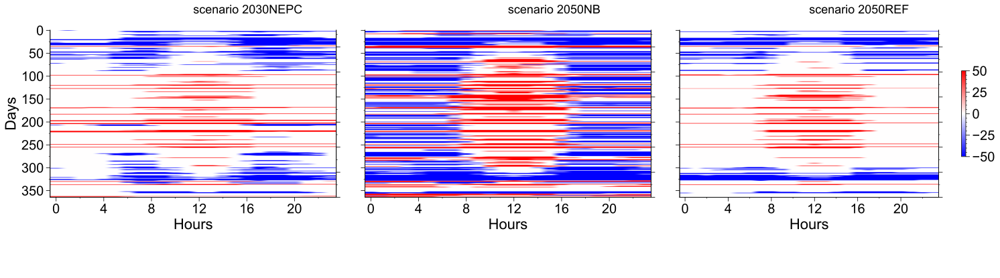

# IF_PPlant_ProxyGeoStorage_CaseStudy

Case study applying coupled models (TESPy power plant and geostorage using semi-analytical gas storage model) for scenario simulation with shares of renewables up to 100%. The aim behind this case study is to demonstrate the new storage model in the [coupled interface tool](https://github.com/fgasa/IF_PPlant_GeoStorage) for dimensioning geological energy storage in renewable energy systems.

 <p align="center"> </p>

## Usage

To call the coupled simulator, use the following:
```bash
python github.com/fgasa/IF_PPlant_GeoStorage/run_if.py -i main_ctrl_file
```
For running the numerical simulator using a commercial simulator, define the simulator path in the control file __.geostorage_ctrl.json__ as "..2017.2\\bin\\pc_x86_64". To run a simulation efficiently load the .SAVE file.

For the semi-analytical/proxy geostorage model, define the simulator path as __..\\scr\\sAGSS.exe__ in the control file.

The semi-analytical simulator syntax is relatively simple. For more detailed information, check the standalone radial model here __\inputs\standalone_geostorage_run__.

Standalone simulation for the numerical model is also available in the same directory. For scenario simulation, well schedule files are used, which are derived from coupled simulations.


<p align="center"> </p>


## Inputs for case study

The energy system model with dispatch model is based on an early study (Gasanzade et al. 2023) with economic boundary conditions and energy system development pathways for Germany developed within the ANGUSII project.

Load profiles for site-specific PM-CAES are available here __..\inputs\loadprofiles__ generated using Gurobi.



Thermodynamic data is based on CoolProp 6.4.1 and is used for both the numerical (dry gas PVDG) and semi-analytical geostorage models (in *.ptdv). The unit system is metric (bar, cP, m³...).

To perform cycle or post-processing routines, it works with TESPy 0.4.4 - Reynolds' Reminiscence.

## License

This repository is licensed under the [GPL-3.0 license](LICENSE). You are free to use, modify and distribute the software under certain conditions. Any distribution of the software must also include a copy of the license and copyright notices.

## Reference

- Gasanzade, F., Witte, F., Tuschy, I. and Bauer, S., 2023. Integration of geological compressed air energy storage into future energy supply systems dominated by renewable power sources. Energy Conversion and Management, 277, __doi:10.1016/j.enconman.2022.116643__ 
- TESPy Version 0.4.4 - Reynolds' Reminiscence, __doi:10.5281/zenodo.4534878__
- National scale energy system scenarios, __doi:10.5281/zenodo.3714708__
- ECLIPSE Reservoir Simulation Software v2017.2, Schlumberger Ltd.
- LLC Gurobi Optimization. Gurobi Optimizer Reference Manual, 2021.  